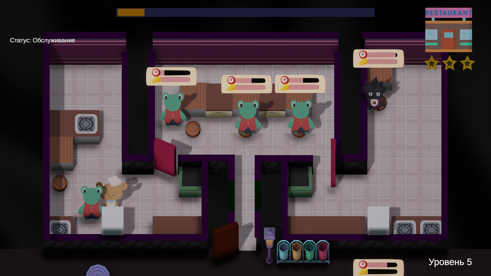
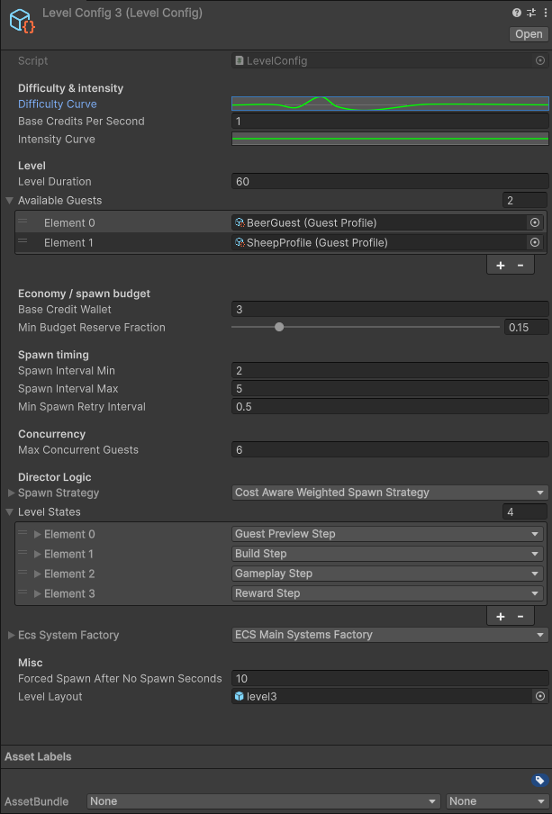
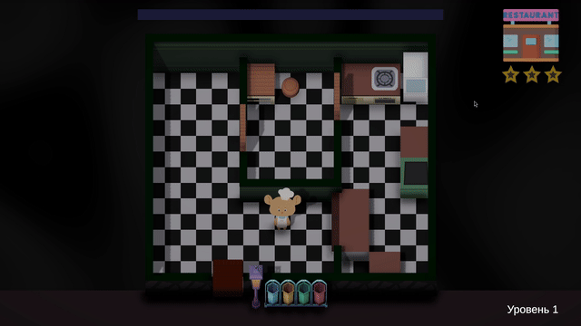
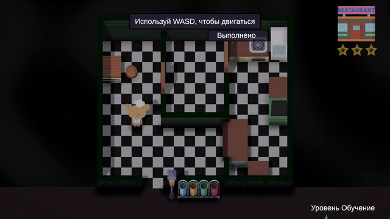

# MiceAhoy

`MiceAhoy` - это симулятор ресторана с локальным мультиплеером, вдохновленный PlateUp!

--- 

В основе игрового процесса - ECS

Реализованна иерархическая система DI контейнеров
1. Root - Конетейрнер для зависемостей которые нужны на всех сценах
2. Game - Те зависимости, которые нужны игровой сцене. 
3. Level - Это контекст конкреного уровня. Точка спавна игрока, запеченный NavMesh для поситителей, все тут.

## Настройка уровней
Реализована гибкая система уровней, на основе Screptable Object.
Весь уровень описывается одной сущностью.

Отдельно выделю LevelStates. Это сценарий уровня. Шаги(сетйты) выполняются последовательно друг за другом.
Используется async/await в execute методе шага. Так мы легко можем выстраисвать цепочки последовательных действий, как пример, шаг с обучением.
Сначала мы подписываемся на нужное нам действие игрока, потом мы ожидаем ивента, напимер что игрок взял мясо. И движемся дальше по коду только после выполение условия.

## Превью шаг

## Обучение

